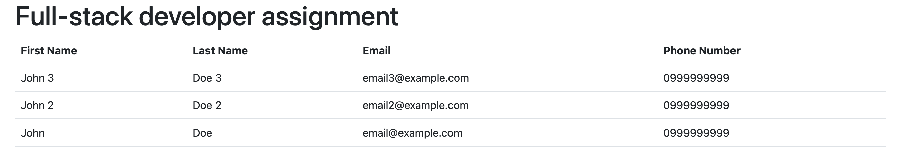

# Golang Engineering Assignment

This is a hands-on coding exercise.

The Golang project contained in this folder has some issues that prevent it from
functioning properly.

In addition to the issues, the application is not feature-complete.

## Objectives

1. Fix all bugs
1. Implement the missing feature outlined in **Application Specs** below

## Application Specs

Our objective is to build a simple survey form that allows users to save data
as well as view previously-entered data.

1. Users should be able to enter data into [form.html](./form.html)
1. Upon submitting the form, data should be saved into [forms.json](./data/forms.json)
1. **TODO:** Users should be able to access a webpage that prints all data contained in [forms.json](./data/forms.json)
  (example screenshot provided below)
   

